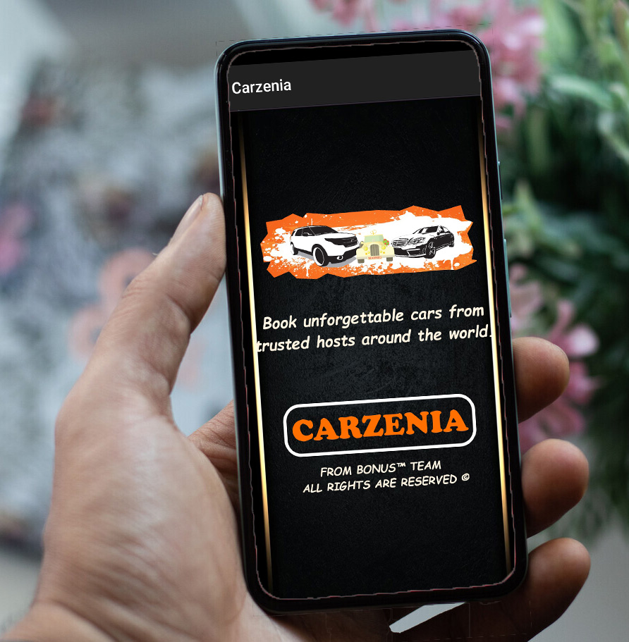

# Carzenia-app

### System Description 

<b>Carzenia</b> is a company that rents cars automobile for short periods of time for a fee.  
        It is often organized with numerous local branches  
        and primarily located near airports or busy city areas  
        and often complemented by an app allowing online reservations.  
***
##### Tools Used
- SQLite
- Firebase
- OOP Concepts
- MVC Model
***
##### Released apk
["Download Link"](https://drive.google.com/file/d/17abAueoXWRjoKGlX9Br4Z0-uQKma63et/view?usp=sharing)
***
## 1- Main Activity (Kareem)

## 2- Login & Signup Activities (Mai)

## 3- Admin, AddCar & Database Creation (Kareem)

## 4- About, Contact, Remove & Display Cars For Admins Activities (Kareem)

## 5- Display Cars For User Activity (Manar)

## 6- Rent Form Activity (Youssef)

## 7- User Profile Activity (Mai)

## 8- Alerts, Update Car, Add Admin, Fragments, Navigation Menue, Display Cars For Admins, Customer Database (Kareem)

## 9- User Feedbacks, Admin Responses and Messages Database (Manar)

